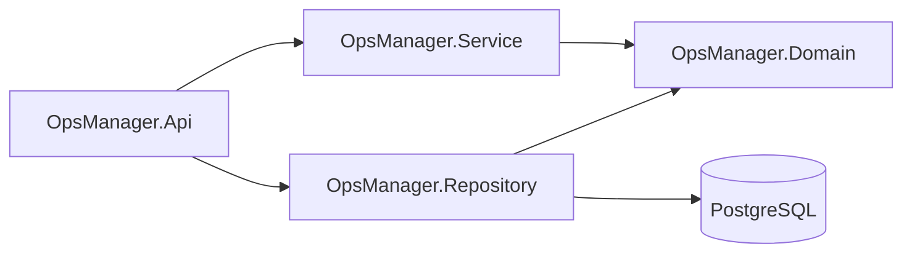
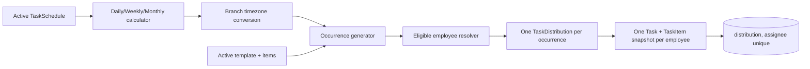

# Architecture

## Layering



- **Domain** owns entities, invariants, enum codes, constants, tenant and repository contracts.
- **Repository** owns EF Core, PostgreSQL mappings/migrations, global filters, materializing projections/joins, UnitOfWork, transactions, and seed data.
- **Service** owns feature DTOs, validators, role/tenant checks, workflows, snapshot copying, reports, notification/audit integration, and scheduler calculations.
- **API** is the composition root and owns verified claim context, JWT/cookies, controllers, rate limiting, local file storage, Problem Details, OpenAPI, and hosted workers.

Service and API do not reference `OpsManagerDbContext`. `IGenericRepository` exposes entities, pagination, counts, materialized projections, and materialized joins but never exposes `DbSet` or `IQueryable`.

## Tenant resolution

```text
Bearer token -> JWT validation -> RequestContext organization claim
                                      |
Controller -> Service authorization -> UnitOfWork -> EF global tenant filter
```

The Service checks resource ownership and authorization; the EF filter is defense in depth. Anonymous organization login/refresh uses a short scoped tenant override only after the target organization ID is selected by the authentication workflow. Platform and hosted system work use an explicit bypass scope. DTO-supplied organization IDs are not used for ordinary tenant operations.

## Schedule flow



The hosted generator runs hourly by default and looks 30 days ahead. Existing generated tasks remain after schedule edits/deactivation. Fixed schedules revalidate configured users; AllDepartmentMembers schedules dynamically resolve current active employees for every run. Unique schedule-occurrence distributions and per-assignee task keys make repeated generation idempotent. Schedules use only structured daily, weekly, and monthly fields; weekly values are normalized before persistence.

## Reliability boundaries

- Main mutations, histories, and audit entries share the same UnitOfWork save/transaction where applicable. Task history keeps the supplied business-event `OccurredAt` separate from persistence audit `CreatedAt`.
- Task-distribution creation persists its per-assignee notifications in the same transaction as every task copy, checklist, and initial history, so partial distributions are rolled back. Notifications in other workflows remain best-effort after the main mutation.
- A lightweight outbox is not included in the MVP. Add one before requiring guaranteed cross-service notification delivery.
- Local uploads use a replaceable `IFileStorageService`; production should replace the local implementation with object storage.

See ADRs [0001](decisions/0001-initial-architecture.md), [0002](decisions/0002-generic-repository-and-unit-of-work.md), [0003](decisions/0003-multi-tenancy-and-soft-delete.md), [0004](decisions/0004-auth-subscription-and-jobs.md), [0005](decisions/0005-task-schedule-and-history-semantics.md), and [0006](decisions/0006-independent-task-distribution.md).
