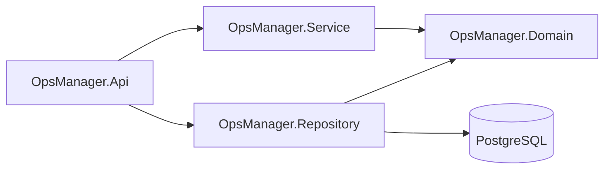

# Architecture

## Layering



- **Domain** owns entities, invariants, enums, constants, repository contracts, pagination contracts, `ITenantContext`, and transaction abstractions. It has no EF Core, ASP.NET Core, or PostgreSQL reference.
- **Repository** owns `OpsManagerDbContext`, configurations, migrations, query filters, `GenericRepository<TEntity>`, `UnitOfWork`, transaction adapters, DI registration, and development seed infrastructure.
- **Service** currently contains only externalizable service abstractions. Prompt 02 adds authorization-aware use cases, DTOs, validation, mappings, and report queries.
- **API** is the composition root. It configures persistence, CORS, Problem Details, OpenAPI, health checks, and opt-in development seeding. It has no business controllers in Prompt 01.

All application data access must flow through `IUnitOfWork` and `IGenericRepository<TEntity>`. The repository materializes reads and does not expose `IQueryable`, `DbSet`, or EF transaction types.

## Request and persistence boundary

```text
HTTP request -> API endpoint/controller -> Service workflow -> IUnitOfWork
                                                     |
                                                     v
                                  Repository + EF filters -> PostgreSQL
```

The scoped tenant context supplies an authenticated organization ID to Repository. Until authentication is added in Prompt 02, the default context has no tenant and tenant-owned queries return no rows. Platform/admin infrastructure must opt into bypass explicitly. Service workflows will still validate referenced-resource ownership; the EF filter is defense in depth, not a replacement for authorization.

## API bootstrap

- `/api/v1` returns API name and assembly version.
- `/health/live` checks only process liveness.
- `/health/ready` checks PostgreSQL connectivity.
- `/openapi/v1.json` is exposed in Development and Testing.
- Built-in exception handling emits RFC 7807 Problem Details without stack traces.
- CORS origins come from `Cors:AllowedOrigins`.

See ADRs [0001](decisions/0001-initial-architecture.md), [0002](decisions/0002-generic-repository-and-unit-of-work.md), and [0003](decisions/0003-multi-tenancy-and-soft-delete.md).
