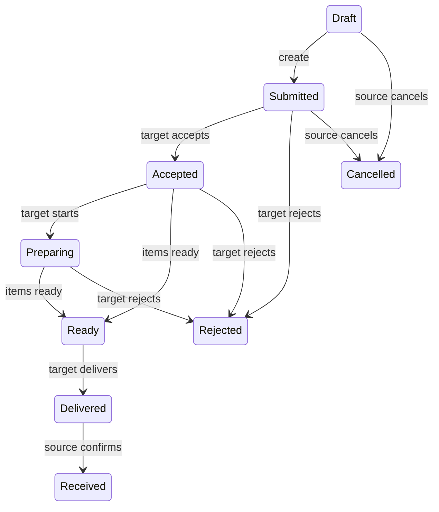

# Department-order workflows

Templates define one same-branch source/target route and ordered item snapshots. Source and target must differ. Custom units require a label; quantities cannot be negative. Retired template items remain for historical references.

Source departments create/cancel orders and confirm receipt. Target departments accept, assign, prepare, mark ready, and deliver. Managers span the tenant; other users require active department scope. Unavailable items use the item `Rejected` state with a fulfillment note. Ready/delivery requires every line to be ready, fulfilled, partially fulfilled, or explicitly rejected.

Received quantity cannot exceed fulfilled quantity. Receipt cannot precede delivery. Rejection requires a reason. Status transitions write history and audit records. Order numbers use `ORD-yyyyMMdd-{uuid}`: human-recognizable, organization scoped by the row, and race-safe without a shared counter.
