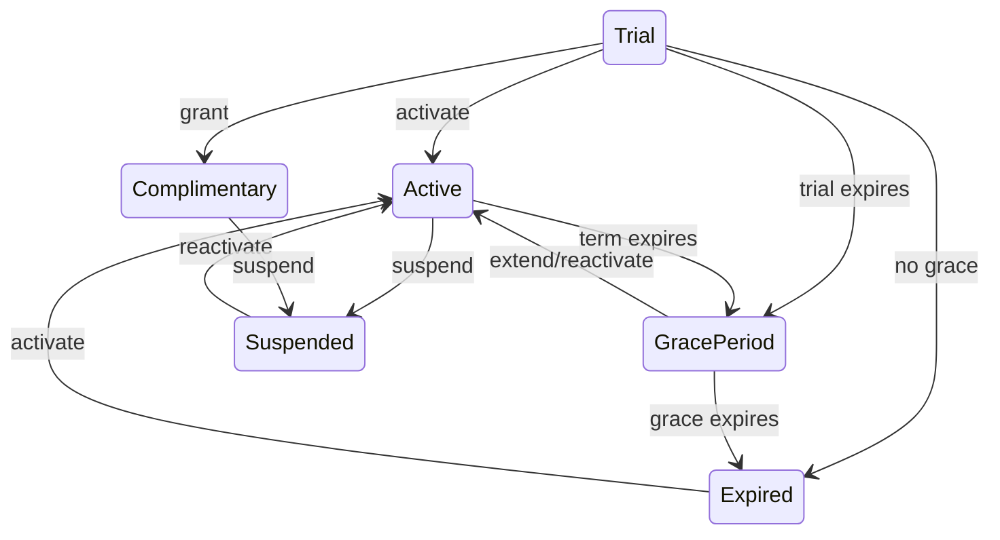

# Subscription workflows

Platform administrators create plans, record manual payments, and activate/extend/change/suspend/reactivate/expire subscriptions. Platform support is read-only. Every change writes subscription history and a platform audit entry. Payment records remain distinct even when an explicitly requested payment+activation workflow runs atomically.

The hourly lifecycle worker moves expired trials/terms into grace or expired status. It never deletes organization data.

Access modes:

- **Full**: active, complimentary, or unexpired trial.
- **GraceLimited**: before `GracePeriodEndsAt`.
- **ReadOnly**: expired/cancelled or grace ended; authentication and reads remain available.
- **Blocked**: suspended/missing access.

Plan user and branch limits are enforced when those resources are created. Feature keys gate tasks, department orders, complaints, and reports.
