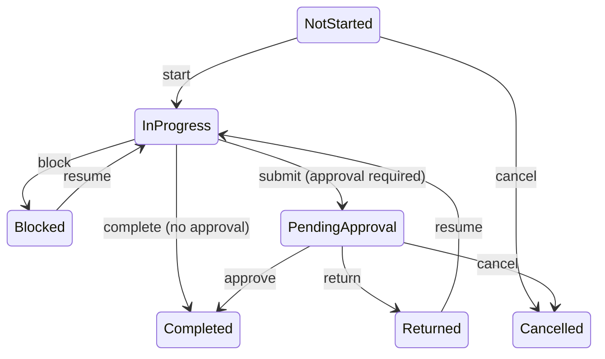

# Task workflows

## Template snapshots

Task templates and active ordered checklist items are copied separately into every assigned employee's task. Later template edits retire old item definitions and do not change existing `OperationalTask`/`TaskItem` text, evidence mode, order, or requirements. Templates may omit a default department and do not store a branch or default assignee; the selected department determines the branch when a task is created. Cloning creates a new distribution and new independent definitions and never copies execution evidence.

## Distribution and assignment

A one-time task request chooses SingleUser, SelectedUsers, or AllDepartmentMembers. The Service validates that every selected user is an active user account, active Employee organization member, and active member of the selected department in the same branch and tenant. Duplicate, suspended, departed, cross-department, cross-branch, and cross-tenant selections are rejected.

Creation is atomic: one `TaskDistribution`, all employee-owned `OperationalTask` copies, all checklist snapshots, initial histories, per-user notifications, and the audit event commit together. Each notification links only to its recipient's task ID. The response returns the distribution ID, mode, created count, and each created task/assignee pair.

Reassignment changes only one task copy. The replacement must be eligible in the same department and cannot already own a sibling copy in that distribution. A `TaskAssignmentHistory` and audit event preserve the old and new owner.

## State flow

- All required items must be completed.
- Any item whose evidence mode is `Required` cannot complete without an attachment; this is independent of whether the checklist item itself is required.
- Completed and cancelled tasks are immutable.
- Execution transitions, checklist updates, and evidence mutations require the current user to own that task copy. Managers and Supervisors may manage authorized copies, but cannot execute an employee's checklist as that employee.
- Every transition writes `TaskStatusHistory`. `OccurredAt` is the immutable business-event time supplied by the workflow; `CreatedAt` is the independent persistence audit time assigned when the history row is saved.
- Submission records `SubmittedForApprovalAt` without marking the task complete. Approval sets `CompletedAt`, `ApprovedAt`, and `ApprovedBy`; return preserves the submission audit timestamp and clears final completion/approval fields.
- Overdue is derived from `DueAt` and non-terminal status; it is not stored as a competing status.
- `OperationalTask`, `TaskItem`, and `TaskSchedule` use PostgreSQL `xmin` optimistic concurrency. Stale writes return a safe HTTP 409 conflict.

## Recurrence and timezones

MVP schedules support daily every N days, weekly every N weeks on selected `Weekday` values, and monthly every N months on a selected day. Months without the selected day are skipped. `DueDayOffset` is either 0 (same day) or 1 (next day), so overnight work is explicit. Only these structured recurrence types are represented in the domain and API contract.

Weekly values are normalized to a distinct, sorted, read-only `Weekdays` collection. New task items explicitly begin in `Pending`; template items can be activated or deactivated idempotently.

For a daylight-saving gap, the generator moves the invalid local time forward one hour. For an ambiguous fall-back time, it selects the earlier occurrence. Existing generated tasks remain after a schedule edit; future runs use the new definition.

Every occurrence creates one distribution and one task/checklist copy per resolved employee. Fixed SingleUser/SelectedUsers schedules keep their configured user IDs but include only users still eligible when generation runs. AllDepartmentMembers is dynamic: employees joining before a future run receive that occurrence, while suspended, departed, deleted, or removed employees do not. Previously generated occurrences never change. Database uniqueness makes repeated generation safe and prevents duplicate employee copies.
